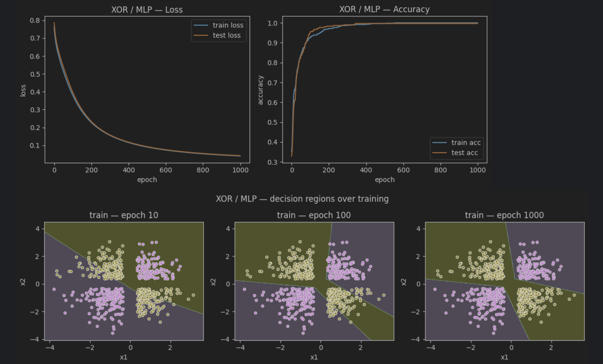
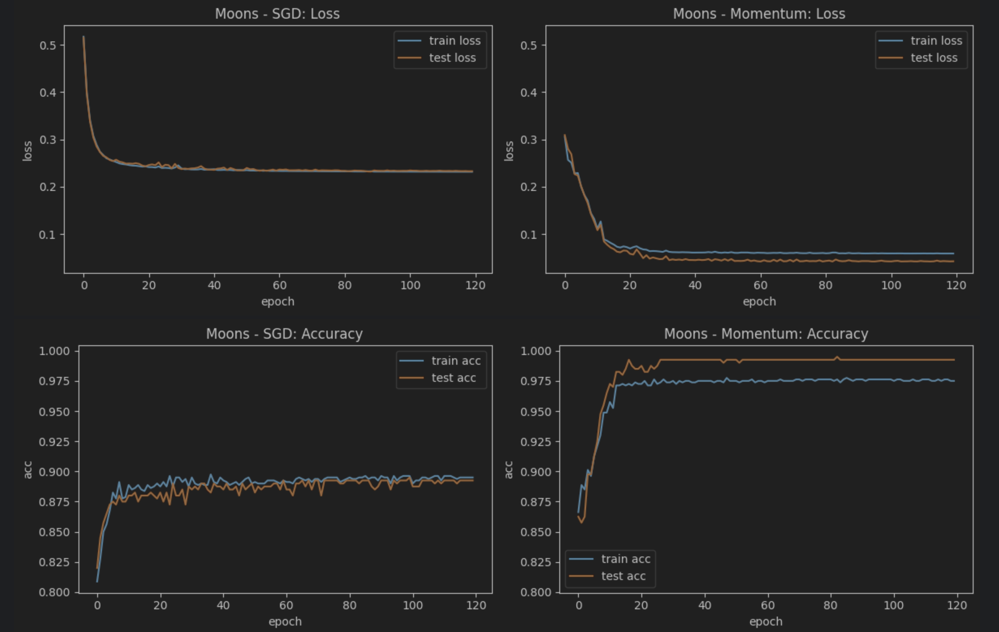
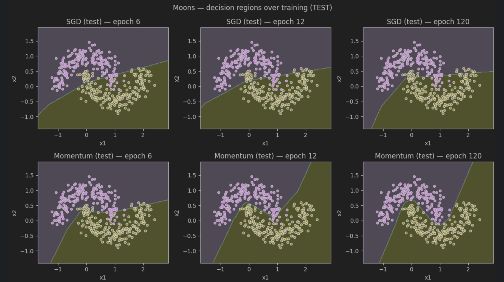

# Neural Network from Scratch (NumPy Only)

A from-scratch implementation of:
- **Logistic Regression**
- **1-hidden-layer Multi-Layer Perceptron (MLP)**

Trained on:
- **XOR dataset** (classic non-linear challenge)
- **Moons dataset** (interleaving half circles)

This project uses **only NumPy** — no TensorFlow, no PyTorch — to build everything manually:
forward pass, backpropagation, gradient descent, momentum updates, and learning rate decay.

---

## Features
- Manual forward pass & backpropagation
- Full-batch and mini-batch Gradient Descent
- **SGD vs SGD + Momentum** comparison
- Learning rate step-decay scheduler
- Visualization of decision regions over training
- Multi-seed evaluation for robustness

---

## Results

---

### XOR Dataset — Solving a Non-Linear Problem

The MLP successfully separates XOR’s classes, reaching **~99.7% test accuracy**.

---

### Moons Dataset — Loss & Accuracy

### Moons Dataset — Decision Regions (TEST)

Momentum achieves faster convergence and cleaner decision boundaries, with higher test accuracy.

---

